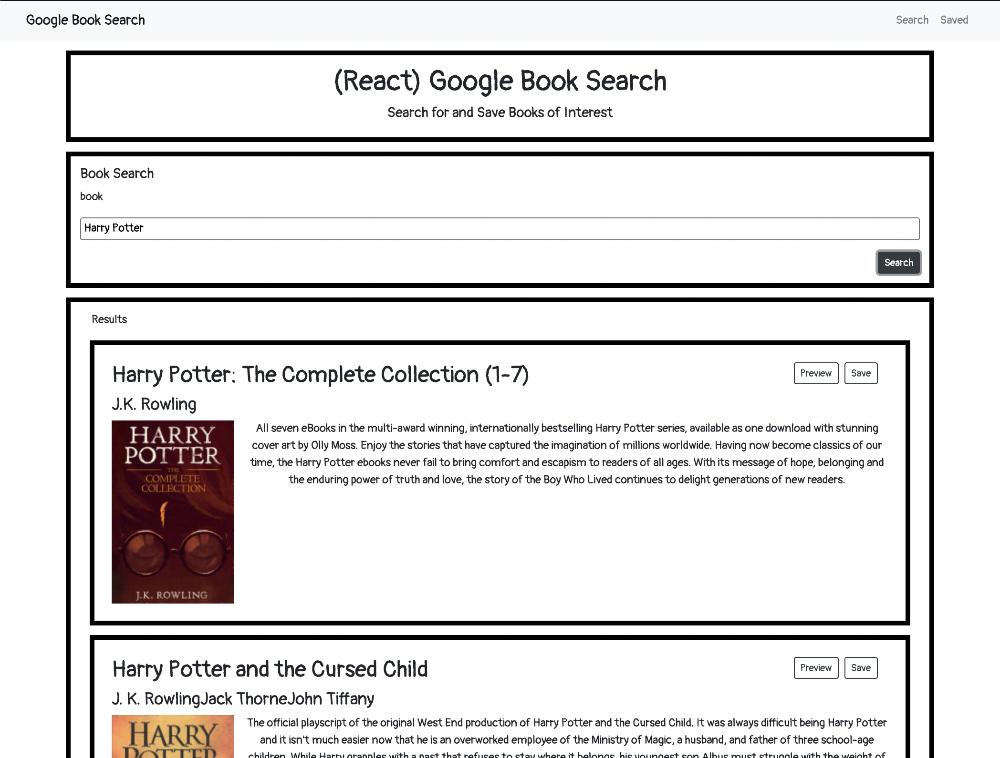
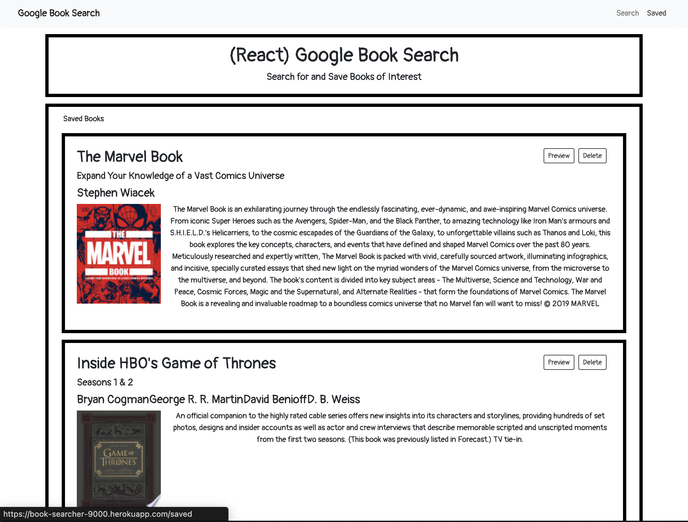

# book-searcher

## About

This full stack application allows the user to search for books using the Google Book API, and then save results to a database for later viewing.

## Table of Contents

- [Usage](#Usage)
- [Contributions](#Contributions)
- [Testing](#Testing)
- [Credits](#Credits)
- [License](#License)
- [Contact](#Contact)

## Usage

Deployed project can be found at [book-searcher](https://book-searcher-9000.herokuapp.com/)

Upon loading the application the user is presented with a search form that allows them to search for books by title. The displayed results offers a link for viewing details and a button to save the book to the database. Upon going to the saved tab, the user can see their previously saved books, and

◊

## Contributions

Contributions can be made by forking the repository on gitHub and submitting a pull request.

The repository can be found at [book-searcher](https://github.com/jacob-af/book-searcher)

## Testing

No testing suites were used in this project.

## Credits

Back end development and deployment was done by Jacob A Feitler, front end source code was provided.

## License:

This project is licensed under the MIT license, copyright 2021

## Contact

You can view my GitHub profile at [github.com/jacob-af](https://github.com/jacob-af)
